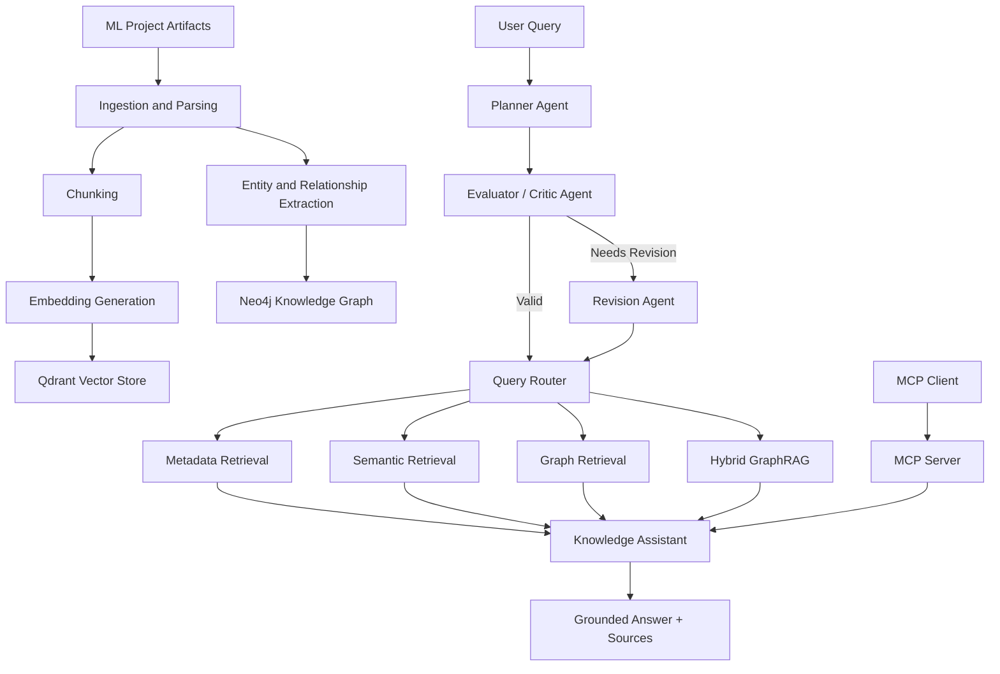

# ML Knowledge Hub

**An agentic hybrid GraphRAG platform for discovering, understanding, and reusing machine-learning knowledge across projects.**

ML Knowledge Hub is a knowledge-management system for ML teams. It helps engineers, data scientists, and applied scientists discover information across project documentation, experiment reports, model cards, dataset descriptions, repositories, research papers, and other technical artifacts.

The system combines:

- metadata lookup
- semantic retrieval with Qdrant
- knowledge-graph reasoning with Neo4j
- hybrid GraphRAG
- grounded answer generation with source references
- agentic query planning with planner–critic–revision orchestration
- MCP access for external AI clients

---

## Motivation

ML projects produce much more than trained models. They also generate:

- design decisions
- datasets
- evaluation results
- experiments
- implementation notes
- model cards
- deployment documentation
- failure analyses
- research references

When this knowledge is scattered across repositories and documents, teams often repeat work or struggle to identify reusable assets.

ML Knowledge Hub organizes these artifacts into a searchable knowledge layer so users can ask questions such as:

- Have we worked on a similar problem before?
- Which models and datasets were used in a project?
- What evaluation evidence exists for a model?
- Which projects used diffusion-based methods?
- Where is the implementation for a particular approach?
- What limitations or deployment issues were reported?
- Which existing assets could be reused for a new project?

---

## Example Company Use Case

Suppose an ML team is building a synthetic-image detection system.

Earlier teams have already produced:

- research experiments
- model cards
- repository documentation
- evaluation reports
- dataset documentation
- deployment notes

A new engineer can ask:

> Which previous projects evaluated diffusion-generated images, and what models, datasets, results, and implementation resources are available?

ML Knowledge Hub can combine structured graph relationships with retrieved document evidence and return a grounded response with source references.

---

## Architecture



---

## Core Capabilities

### Agentic Query Planning

User queries are translated into structured execution plans using a planner agent.

A critic agent validates the plan before execution. If needed, a revision agent produces a corrected plan.

```text
User Query
    ↓
Planner Agent
    ↓
Initial Plan
    ↓
Evaluator / Critic
    ↓
Revision Agent if needed
    ↓
Final Plan
    ↓
Query Router
```

Supported query modes include:

- metadata
- semantic
- graph
- hybrid

### Semantic Retrieval

Documents are embedded using `sentence-transformers/all-MiniLM-L6-v2` and stored in a persistent Qdrant vector index.

Semantic retrieval supports filtering by:

- project ID
- artifact type

This enables project-scoped and artifact-specific retrieval.

### Knowledge Graph

Structured relationships between ML assets are stored in Neo4j.

The graph connects entities such as:

- projects
- models
- datasets
- metrics
- repositories
- experiments
- technical artifacts

Example graph queries include:

- models used by a project
- datasets associated with a model
- metrics reported for a model
- model-level context
- project-level context

### Hybrid GraphRAG

Hybrid retrieval combines:

1. structured knowledge from Neo4j
2. supporting passages from Qdrant
3. LLM-based grounded answer generation

This allows the system to answer broader questions that require both relationship reasoning and document evidence.

### Grounded Answer Generation

Generated responses include supporting source metadata such as:

- source ID
- project ID
- artifact type
- document ID
- title
- source URL

The generation layer is designed to avoid introducing claims that are unsupported by retrieved evidence.

### MCP Interface

ML Knowledge Hub exposes its capabilities through a Model Context Protocol server.

Current MCP tools include:

- `health_check`
- `list_projects`
- `count_projects`
- `search_knowledge`
- `warm_up`

The MCP layer acts as a thin adapter around the existing `KnowledgeAssistant` rather than implementing separate retrieval logic.

The full assistant stack is initialized lazily to avoid delaying the MCP connection handshake.

---

## Guardrails

The MCP interface includes basic safety and reliability controls.

Implemented safeguards include:

- empty-query validation
- structured error responses
- sanitized client-facing errors
- server-side exception logging
- source-grounded responses
- separation of external error messages from internal stack traces

---

## Corpus

The current corpus contains multiple ML artifact types centered on synthetic-image detection.

Examples include:

- research papers
- repository READMEs
- model cards
- dataset cards
- dataset metadata
- reproducibility reports
- evaluation reports
- experiment reports
- deployment notes
- postmortems
- project briefs

The corpus currently represents **14 ML projects** and is used to evaluate cross-project retrieval and knowledge reuse.

Example projects include:

- GenImage
- SynthBuster
- DIRE
- MaskSim
- UniversalFakeDetect
- CNNDetection
- NYUAD AI Image Detector

---

## Evaluation

The system is evaluated at two levels.

### Agentic Planning Evaluation

A 30-query benchmark evaluates:

- routing accuracy
- execution-plan accuracy
- strict full-plan accuracy
- critic behavior
- revision success
- ambiguous multi-reference queries

Current results:

| Metric | Result |
| --- | ---: |
| Final routing accuracy | 96.67% |
| Final execution-plan accuracy | 93.33% |
| Final full-plan accuracy | 76.67% |
| Revision success rate | 100% |

### End-to-End Retrieval Evaluation

A separate benchmark evaluates final retrieval and answer behavior.

The current MVP baseline on 10 representative queries is:

| Metric | Result |
| --- | ---: |
| Strict end-to-end pass rate | 50.0% |
| Project retrieval accuracy | 44.44% |
| Asset-type retrieval accuracy | 60.0% |
| Required-fact accuracy | 70.0% |
| Source coverage | 80.0% |

Error analysis indicates that project/entity resolution and project-filter propagation are the main remaining failure modes.

This benchmark is intended as an MVP diagnostic rather than a complete semantic answer-quality evaluation.

---

## Tech Stack

| Component | Technology |
| --- | --- |
| Core implementation | Python |
| Schemas / validation | Pydantic |
| PDF extraction | PyMuPDF |
| Embeddings | sentence-transformers |
| Vector database | Qdrant |
| Knowledge graph | Neo4j AuraDB |
| LLM reasoning / generation | OpenAI API |
| MCP interface | MCP Python SDK |
| Testing | pytest |
| Environment configuration | python-dotenv |

---

## Project Structure

| Path | Purpose |
| --- | --- |
| `data/raw/` | Corpus and asset manifest |
| `data/qdrant/` | Persistent local vector index |
| `data/knowledge_graph/` | Knowledge-graph entity data |
| `data/evaluation/` | Planning and retrieval benchmarks |
| `scripts/` | Indexing, testing, and evaluation workflows |
| `src/ml_knowledge_hub/ingestion/` | Document ingestion and parsing |
| `src/ml_knowledge_hub/registry/` | Asset registry |
| `src/ml_knowledge_hub/vectorstore/` | Qdrant integration |
| `src/ml_knowledge_hub/knowledge_graph/` | Neo4j graph services |
| `src/ml_knowledge_hub/rag/` | Grounded generation |
| `src/ml_knowledge_hub/query/` | Query routing and planning |
| `src/ml_knowledge_hub/agents/` | Planner, critic, and revision agents |
| `src/ml_knowledge_hub/assistant/` | End-to-end assistant orchestration |
| `src/ml_knowledge_hub/mcp_server/` | MCP interface |
| `tests/` | Automated tests |

---

## Setup

Create and activate a virtual environment:

```bash
python -m venv .venv
source .venv/bin/activate
```

Install the project:

```bash
pip install -e .
```

Create a `.env` file containing the required credentials:

```text
OPENAI_API_KEY=...
NEO4J_URI=...
NEO4J_USERNAME=...
NEO4J_PASSWORD=...
```

Do not commit `.env`.

---

## Running Tests

```bash
pytest
```

---

## Running the MCP Server

```bash
python src/ml_knowledge_hub/mcp_server/server.py
```

The server can be connected to an MCP-compatible client such as MCP Inspector.

---

## Example Queries

```text
How many projects do we have?
```

```text
Which models are used by the NYUAD project?
```

```text
What do we know about GenImage as a project?
```

```text
What implementation information is available for DIRE?
```

```text
Which projects use diffusion-based methods?
```

---

## Current Status

### Implemented

- [x] Multi-format ML asset registry
- [x] PDF and text-document ingestion
- [x] Document chunking
- [x] Embedding generation
- [x] Persistent Qdrant indexing
- [x] Metadata retrieval
- [x] Semantic search
- [x] Entity and relationship extraction
- [x] Neo4j knowledge graph
- [x] Graph retrieval
- [x] Hybrid GraphRAG
- [x] Grounded RAG with source references
- [x] Planner–critic–revision agent workflow
- [x] MCP server
- [x] MCP lazy initialization
- [x] Input and error guardrails
- [x] Planning benchmark
- [x] End-to-end retrieval benchmark
- [x] Automated tests

### Future Work

- [ ] Improve project/entity resolution
- [ ] Improve project-filter propagation
- [ ] Add richer answer-grounding evaluation
- [ ] Add additional enterprise document types
- [ ] Support external repository and document integrations
- [ ] Add API and interactive demo interface
- [ ] Run Qdrant as a standalone service for multi-process access
- [ ] Containerized deployment

---

## Design Principles

ML Knowledge Hub is designed around several principles:

- **Grounded answers:** generated responses should be supported by retrieved evidence.
- **Hybrid reasoning:** structured graph relationships and semantic document evidence complement each other.
- **Reusable services:** MCP exposes existing application services rather than duplicating business logic.
- **Typed planning:** LLM reasoning produces structured execution plans before deterministic execution.
- **Evaluation-first development:** planning and retrieval behavior are measured using explicit benchmarks.
- **Safe integration:** external clients receive controlled error responses rather than internal implementation details.

---

## License

A project license has not yet been specified.

External papers, repositories, datasets, model cards, and other assets remain subject to their respective licenses and terms of use.
