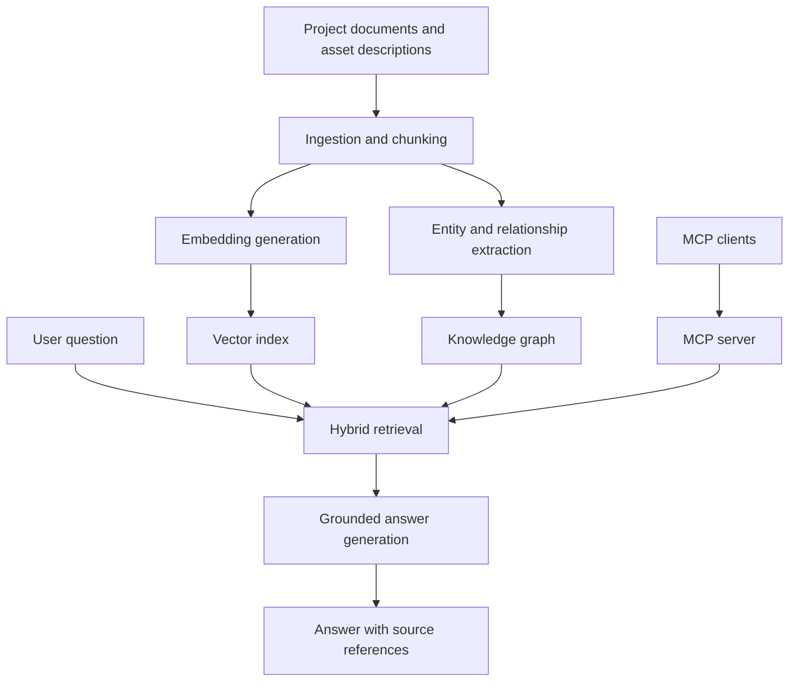

# ML Knowledge Hub

**An ML project knowledge assistant for discovering, understanding, comparing, and reusing existing machine-learning assets.**

ML Knowledge Hub aims to help ML engineers, data scientists, and applied scientists find useful knowledge across project documentation, experiment reports, model cards, dataset descriptions, repositories, and research papers. It combines semantic search with a planned Retrieval-Augmented Generation (RAG) pipeline, knowledge graph, and Model Context Protocol (MCP) interface.

The current prototype supports PDF ingestion, embedding generation, and semantic retrieval. Grounded answer generation, graph-based retrieval, and MCP access are upcoming milestones.

## Motivation

An ML project produces more than a trained model. It also produces information about the problem, data, experiments, evaluation results, implementation decisions, and known limitations. When this knowledge is scattered across documents and repositories, teams can struggle to identify relevant previous work and decide what to reuse.

ML Knowledge Hub is designed to make that project knowledge searchable and connect related assets, so a team can answer questions such as:

- Have we worked on a similar problem before?
- Which models and datasets were used, and where is the implementation?
- What experiments were tried, and what limitations were reported?
- Which existing assets could provide a starting point for a new project?

## Example Company Use Case

An ML engineer joins a team developing a synthetic-image detection system. Earlier projects have produced evaluation reports, dataset documentation, model cards, and repository READMEs. The engineer needs to understand the previous work before choosing a baseline.

The intended workflow is to ask:

> Which previous image-detection projects evaluated diffusion-generated images? Show their models, datasets, reported results, limitations, and implementation links.

The assistant would retrieve supporting passages, follow relationships between projects and assets, and produce an answer with source references. Comparisons should preserve evaluation context, such as dataset, split, and metric, and identify missing evidence.

This is a target workflow; the current prototype provides semantic retrieval over ingested PDFs.

## Project Knowledge and Assets

The intended knowledge sources include:

| Artifact | Knowledge it contributes |
| --- | --- |
| Project overview or technical design document | Problem, objectives, approach, and design decisions |
| Experiment report | Methods tried, configurations, observations, and unsuccessful approaches |
| Evaluation report | Metrics, benchmarks, comparisons, and failure cases |
| Model card | Model purpose, intended use, evaluation, and limitations |
| Dataset card or description | Data source, labels, preprocessing, splits, and constraints |
| Repository README | Implementation location, setup, dependencies, and usage |
| Deployment or maintenance notes | Operating requirements and known issues |
| Research paper | Supporting methods, external baselines, and published evidence |

These describe the planned scope. Ingestion currently supports PDFs; additional document formats and source integrations remain future work. Model weights and raw training datasets are represented through their descriptions and references rather than treated as text documents.

## Initial Demo Corpus

The initial corpus uses research papers on synthetic-image detection to develop and check the retrieval pipeline with public material. Papers provide descriptions of models, datasets, methods, metrics, and limitations that can later be linked in a knowledge graph.

The broader application is ML project knowledge discovery and reuse. A future demo can extend the corpus with public model cards, dataset cards, repository documentation, and clearly labeled sample project reports.

## Current Status

The project is in early development.

Implemented so far:

- Python project structure and ML asset schema
- PDF text extraction and document chunking
- End-to-end PDF ingestion pipeline
- Embedding generation with sentence-transformers
- In-memory Qdrant vector search
- Initial manual relevance checks using real research papers
- Unit tests with pytest

The current search prototype retrieves relevant passages. It does not yet generate grounded answers or perform graph-based retrieval. In-memory storage is intended for local development; persistent indexing remains a future step.

## Planned Architecture



- **Semantic retrieval:** Find relevant passages even when question wording differs from the source.
- **Knowledge graph:** Connect projects, models, datasets, experiments, papers, and repositories through explicit relationships.
- **Hybrid GraphRAG:** Combine passage retrieval with graph traversal to answer questions spanning related assets.
- **Grounded generation:** Build answers from retrieved evidence and include source references.
- **MCP access:** Expose retrieval and asset lookup as tools for compatible AI clients.
- **Guardrails:** Plan for evidence checks, insufficient-evidence responses, and treating retrieved content as untrusted input.

## Tech Stack

| Component | Technology | Status |
| --- | --- | --- |
| Core implementation | Python | In use |
| PDF extraction | PyMuPDF | In use |
| Data validation and schemas | Pydantic | In use |
| Text embeddings | sentence-transformers | In use |
| Vector search | Qdrant | In-memory prototype |
| Testing | pytest | In use |
| Knowledge graph | Neo4j | Planned |
| Answer generation and structured extraction | OpenAI API | Planned |
| Application API | FastAPI | Planned |
| Tool interface | MCP Python SDK | Planned |
| Demo interface | Streamlit | Planned |
| Packaging | Docker | Planned |

## Project Structure

| Path | Purpose |
| --- | --- |
| `data/` | Local input data and processing outputs |
| `docs/` | Project documentation |
| `notebooks/` | Exploration and experiments |
| `scripts/` | Workflow scripts |
| `src/ml_knowledge_hub/` | Application package |
| `src/ml_knowledge_hub/ingestion/` | Document ingestion components |
| `src/ml_knowledge_hub/knowledge_graph/` | Knowledge graph module |
| `tests/` | Automated tests |
| `pyproject.toml` | Project configuration and dependencies |

## Setup

From the repository root, create and activate a virtual environment:

```bash
python -m venv .venv
source .venv/bin/activate
```

Install the project:

```bash
pip install -e .
```

Run tests:

```bash
pytest
```

## Roadmap

- [x] PDF ingestion and text chunking
- [x] Embedding generation
- [x] Local vector search with in-memory Qdrant
- [x] Initial semantic retrieval checks on research papers
- [ ] Basic RAG pipeline with source references
- [ ] Structured entity and relationship extraction
- [ ] Knowledge graph construction with Neo4j
- [ ] Hybrid vector and graph retrieval
- [ ] MCP server for retrieval and asset lookup
- [ ] Grounding and insufficient-evidence guardrails
- [ ] Evaluation of retrieval quality, answer grounding, and vector-only versus hybrid retrieval
- [ ] Broader project-document corpus and additional ingestion formats
- [ ] Persistent indexing
- [ ] Demo interface and API-key-safe deployment

The initial MVP targets a two-week development window, with a $0/month infrastructure budget and an LLM development budget of at most $10. The roadmap includes follow-on work beyond that MVP. API keys must remain outside version control and browser-delivered code.

## License

A project license has not yet been specified. Source documents and external assets remain subject to their respective licenses.
